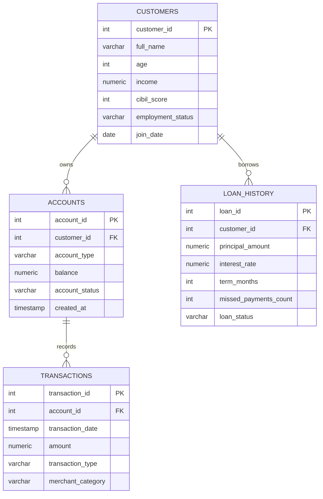

# Retail Banking Credit Risk & Churn Analytics (PostgreSQL)

## Executive Summary

A pure-SQL analytics project for a generic retail bank. It models customers, accounts, transactions and loans in PostgreSQL, then answers three business problems:

- **Credit Risk Evaluation:** a reusable view scores every customer as Low, Medium or High Risk using CIBIL score, Debt-to-Income ratio and missed payments.
- **Churn Prevention:** quarter-over-quarter transaction drop-offs are ranked into quartiles, and high-balance dormant accounts are flagged for outreach.
- **NPA Management:** a multi-stage CTE measures exposure and default percentages across income bands.

All data is synthetic. Dates are generated relative to the day the script runs, so the dormancy and churn scenarios stay valid.

## Repository Contents

| File | Purpose |
|---|---|
| `schema_and_data.sql` | Creates 4 tables, indexes, and loads synthetic data (15 customers, 20 accounts, 66 transactions, 15 loans) |
| `analysis_queries.sql` | 6 analytical queries, including the `view_credit_risk_scoring` view |
| `README.md` | This documentation |

## Entity Relationship Diagram



ASCII version:

```
CUSTOMERS (1) ----< (N) ACCOUNTS (1) ----< (N) TRANSACTIONS
    |
    +-----------< (N) LOAN_HISTORY
```

## Key Technical Concepts Highlighted

- **Window functions:** `SUM() OVER` with `ROWS` and `RANGE` frames (rolling velocity), `LAG()` / `LEAD()` (churn and month-over-month trends), `NTILE(4)` (risk quartiles), and portfolio-wide totals with an empty `SUM() OVER ()`.
- **Common Table Expressions:** multi-stage `WITH` pipelines for churn, NPA analysis and balance trends, plus a calendar CTE (`GENERATE_SERIES`) so quiet periods count as zero instead of disappearing.
- **Views:** `view_credit_risk_scoring` packages the scoring logic once so any report can reuse it.
- **Conditional aggregation:** `SUM(...) FILTER (WHERE ...)`, `COUNT(*) FILTER (WHERE ...)` and `CASE WHEN` inside aggregates.
- **Financial math in SQL:** EMI computed with the amortisation formula to derive a true Debt-to-Income ratio.
- **Data integrity:** primary keys, foreign keys with `ON DELETE CASCADE`, `CHECK` constraints, defaults and supporting indexes.

## Key Analytical Insights

1. **Risk concentration:** 6 of 15 customers are classified High Risk, 4 are Medium and 5 are Low. Every customer with a defaulted loan is High Risk, so the scoring rules agree with actual loan outcomes.
2. **NPA is an income-segment problem:** across the open loan book of INR 2.425 crore, defaulted exposure is INR 20.5 lakh, a gross NPA ratio of about 8.45%. Defaults sit entirely in the two lowest income bands: about 65.6% of exposure is defaulted in the Below 5L band and about 30.8% in the 5L to 10L band, while the 10L to 20L and Above 20L bands show 0%.
3. **Idle capital:** six accounts hold INR 25.88 lakh with no transaction in 90 days (one has never transacted). These are prime candidates for re-engagement or compliance review.
4. **Churn signal:** customers whose quarterly transaction count collapsed (for example, an account that was active every month and then went almost silent) land in the top churn quartile, giving the retention team a ranked call list.
5. **Velocity patterns:** the rolling 30-row versus 30-day comparison shows why frame choice matters. A row-based window stretches across many months for low-activity customers, while the calendar window reflects true recent spending.
6. **Deposit growth:** the month-over-month view separates months driven by one-off business inflows from steady salary-driven growth, which helps judge how stable the deposit base is.

## How to Run

1. Create a PostgreSQL database named `retail_bank_analytics`.
2. Run `schema_and_data.sql` in full.
3. Run `analysis_queries.sql` one query at a time (highlight the query, then execute).

## Requirements

PostgreSQL 12 or newer (the `RANGE ... INTERVAL` window frame needs version 11+). Tested workflow: pgAdmin 4.
